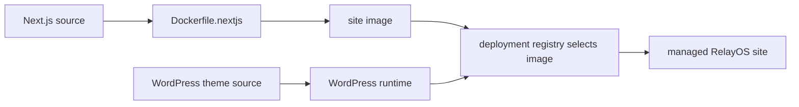

# getrelayos.com

## BLUF

This repo owns the public RelayOS marketing site source.

Use it for Next.js page/component changes, Tailwind styling, public assets, and
the bundled WordPress theme source. Do not put production secrets, tenant data,
DNS, certificate wiring, or deployment selection in this repo.

## Reader Paths

| Goal | Start here |
| --- | --- |
| Edit the public site UI | [`pages/`](pages/) and [`components/`](components/) |
| Change styling | [`styles/globals.css`](styles/globals.css) and [`tailwind.config.js`](tailwind.config.js) |
| Change WordPress theme source | [`wordpress/themes/relayos/`](wordpress/themes/relayos/) |
| Inspect local Compose wiring | [`docker-compose.yml`](docker-compose.yml) |
| Inspect production image build | [`Dockerfile.nextjs`](Dockerfile.nextjs) |
| Verify public offering claims | [presales offering evidence](docs/presales-offering-evidence.md) |

## Stack Shape



Local Compose is for development and inspection. Managed environments use the
fleet deployment path rather than this repository selecting live state directly.

## Local Development

Install dependencies and run the Next.js development server:

```bash
npm ci
npm run dev
```

Useful checks:

```bash
npm run lint
npm run build
npm test
```

`npm test` runs the repository docs contract. It does not replace browser QA or
deployment acceptance.

## Deployment Boundary

This repo supplies source and build inputs. Deployment-owned systems supply:

- image selection.
- hostnames.
- TLS certificates.
- WordPress database credentials.
- OAuth and SMTP secrets.
- tenant or platform runtime configuration.

If a change needs one of those values, start from the
[RelayOS deploy stack](https://github.com/relayos/relayos-deploy). IRC runtime
configuration belongs in the
[IRC operator config repo](https://github.com/relayos/relayos-irc-config), and
environment materialization belongs in
[infra-registry](https://gitea.i.cyberstorm.dev/relaxgg/infra-registry).

## Change Checklist

1. Edit the smallest page, component, library, style, or theme file.
2. Run `npm run lint`, `npm run build`, and `npm test`.
3. Open a focused pull request.
4. After merge, promote the built image or deployment selection through the
   environment-owned GitOps path documented in the
   [RelayOS deploy stack](https://github.com/relayos/relayos-deploy).
5. Verify the live page or WordPress behavior in the target environment.

## Agent Contract

- Keep public site source separate from tenant runtime data.
- Prefer component-local changes over global style changes unless the visual
  system itself changes.
- Keep secrets and host-specific values out of tracked files.
- Update this README when adding a new top-level source surface.
