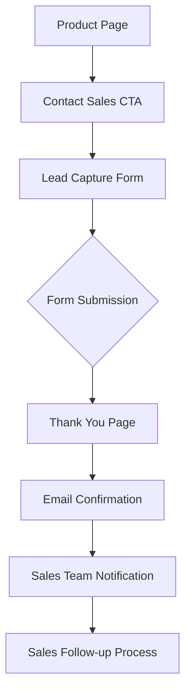
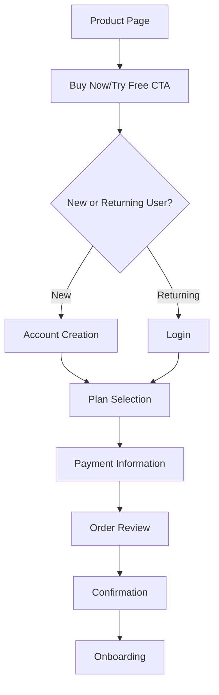
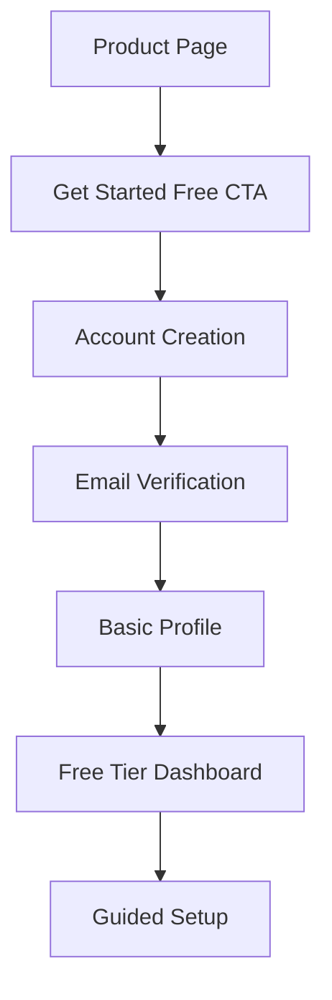

# Differentiated Purchase/Contact Flows

## Overview

This document outlines the differentiated purchase and contact flows for RelayOS products, addressing the distinct business models for B2B and B2C offerings. These flows are designed to optimize conversion rates while providing appropriate user experiences for different customer types.

## Core Principles

1. **Business Model Alignment**: Tailor flows to match each product's business model
2. **Friction Reduction**: Minimize steps and form fields to improve conversion rates
3. **Value Reinforcement**: Maintain value proposition messaging throughout the flow
4. **Trust Building**: Incorporate appropriate trust signals at decision points
5. **Data Collection Balance**: Gather necessary information without overwhelming users

## B2B Contact Flow

### Target Products
- RelayOS Connect™
- RelayOS Integrate™
- RelayOS Nexus™
- RelayOS Embed™ (Enterprise tier)

### Flow Structure

### Lead Capture Form

**Initial Fields (Step 1):**
- First Name*
- Last Name*
- Business Email*
- Company Name*
- Phone Number

**Qualification Fields (Step 2):**
- Company Size
- Industry
- Primary Interest (product selection)
- Timeline
- Brief Description of Needs

**Form Design Principles:**
- Two-step progressive form to reduce initial friction
- Clear progress indicator
- Inline validation with helpful error messages
- Autosave functionality to prevent data loss
- Mobile-optimized input fields

### Thank You Page Elements

- Confirmation message
- Expected response time (e.g., "A sales representative will contact you within 1 business day")
- Relevant resources to review while waiting
- Calendar link to proactively schedule a call
- Social proof elements (logos, testimonials)

### Email Confirmation Elements

- Confirmation of request receipt
- Introduction to the sales process
- Relevant resources (whitepapers, case studies)
- Calendar link to schedule a call
- Contact information for questions

### Sales Team Notification

- Lead details delivered to CRM
- Automatic lead scoring based on form responses
- Assignment to appropriate sales representative
- Notification with complete lead information

## B2C Purchase Flow

### Target Products
- RelayOS Persist™
- RelayOS Communities™

### Flow Structure

### Account Creation Form

**Required Fields:**
- Email Address*
- Password*
- Password Confirmation*

**Optional Fields:**
- First Name
- Last Name

**Form Design Principles:**
- Minimal required fields to reduce friction
- Social sign-in options (Google, Apple, etc.)
- Clear password requirements
- Email verification that doesn't interrupt the flow

### Plan Selection Interface

**Elements:**
- Clear plan comparison table
- Highlighted recommended plan
- Monthly/Annual toggle with savings callout
- Bundle options (Persist™ + Communities™)
- Feature comparison by plan
- FAQ section addressing common questions

**Design Principles:**
- Visual distinction between plans
- Clear pricing display
- Feature tooltips for additional information
- Mobile-optimized layout

### Payment Information Form

**Required Fields:**
- Credit Card Number*
- Expiration Date*
- CVV*
- Billing Address*

**Optional Fields:**
- Promotional Code

**Form Design Principles:**
- Credit card field with visual card type detection
- Address autocomplete functionality
- Secure form indicators (lock icon, security badges)
- Clear display of payment amount and billing frequency

### Order Review Page

**Elements:**
- Selected plan details
- Pricing breakdown (including discounts)
- Payment method information (masked)
- Terms of service acceptance
- Privacy policy acceptance
- Clear "Complete Purchase" CTA

### Confirmation Page

**Elements:**
- Order confirmation message
- Order summary
- Account access instructions
- Getting started guide
- Support contact information
- Social sharing options

### Onboarding Flow

**Steps:**
1. Welcome screen with key features
2. Profile completion
3. Privacy settings configuration
4. Feature tour
5. Mobile app download prompt

## Dual-Approach Flow (Free + Enterprise)

### Target Products
- RelayOS Embed™

### Free Tier Flow Structure

### Enterprise Tier Flow Structure

### Free Tier Account Creation

**Required Fields:**
- Email Address*
- Password*
- Password Confirmation*

**Optional Fields:**
- First Name
- Last Name
- Company/Organization

**Form Design Principles:**
- Minimal required fields
- Developer-focused experience
- GitHub/GitLab sign-in options
- Clear indication of free tier limitations

### Free Tier Dashboard Elements

- API key generation
- Usage statistics
- Documentation access
- Upgrade path to Enterprise
- Community forum access

### Enterprise Upgrade Path

- In-product "Contact Sales" CTAs
- Usage-based upgrade prompts
- Feature comparison highlighting Enterprise benefits
- Case studies demonstrating Enterprise value

## Mobile Optimization

### B2B Contact Flow Mobile Optimizations

- Single-column form layout
- Larger touch targets for form fields
- Simplified form with fewer fields on mobile
- Click-to-call option for direct contact
- Mobile-optimized thank you page

### B2C Purchase Flow Mobile Optimizations

- Mobile wallet integration (Apple Pay, Google Pay)
- Streamlined checkout process
- Touch-friendly plan selection
- Simplified form navigation
- Mobile-optimized confirmation emails

## Analytics and Optimization

### Key Metrics to Track

**B2B Contact Flow:**
- Form start rate
- Form completion rate
- Field abandonment points
- Time to complete form
- Lead quality score

**B2C Purchase Flow:**
- Cart abandonment rate
- Conversion rate by plan
- Average order value
- Trial conversion rate
- Payment failure rate

### A/B Testing Strategy

**B2B Contact Flow Tests:**
- Form length (number of fields)
- Form step sequence
- CTA wording variations
- Social proof placement
- Thank you page content

**B2C Purchase Flow Tests:**
- Pricing display formats
- Plan comparison layouts
- Payment method options
- Order review page layout
- Promotional messaging

## Implementation Requirements

### Technical Components

1. **Form Component Library**: Reusable, validated form components
2. **Payment Processing Integration**: Secure payment gateway integration
3. **CRM Integration**: Lead data synchronization with sales CRM
4. **User Account System**: Secure authentication and profile management
5. **Analytics Implementation**: Conversion tracking and funnel analysis

### Content Requirements

1. **Form Microcopy**: Clear, helpful text for form fields and error messages
2. **Confirmation Messaging**: Thank you pages and confirmation emails
3. **Trust Signals**: Security badges, testimonials, and privacy assurances
4. **Help Content**: FAQs and support information at critical decision points
5. **Onboarding Materials**: Getting started guides and tutorials

## Next Steps

1. Create detailed wireframes for each flow
2. Develop form component prototypes
3. Set up payment processing integration
4. Implement CRM integration for lead handling
5. Develop analytics tracking plan
6. Create content for all flow touchpoints
